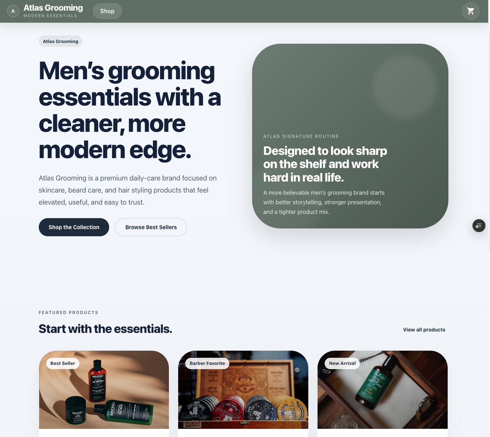
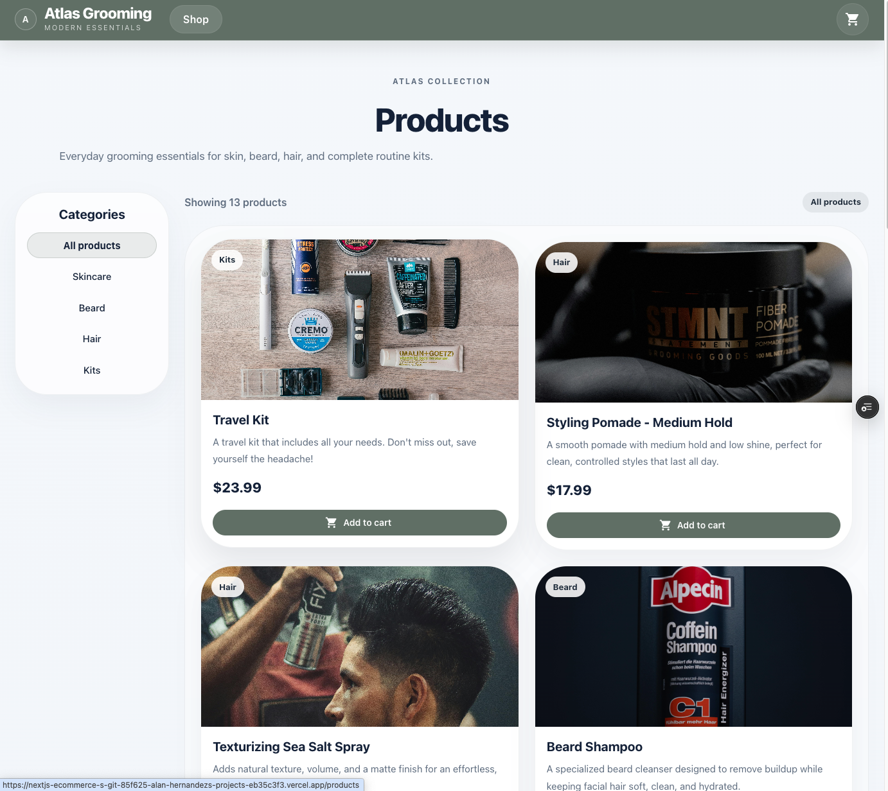
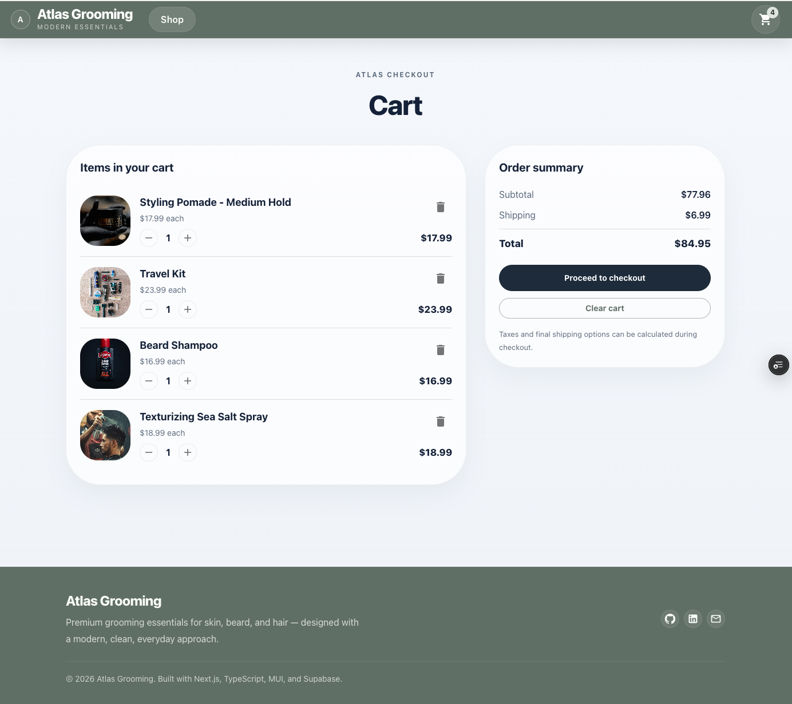
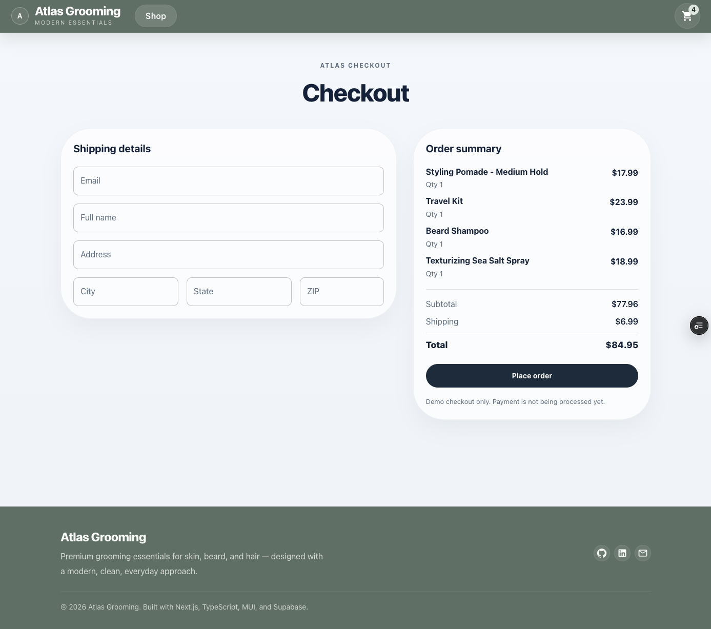

# 🛍️ Atlas Grooming — Fullstack E-Commerce App

## 📸 Screenshots

### 🏠 Home Page

### 🛍️ Product Page

### 🛒 Cart

### 💳 Checkout

A modern, fullstack e-commerce application built with **Next.js 16 (App Router)**, **TypeScript**, **Supabase**, and **Material UI**.

This project simulates a real-world online store with dynamic product data, persistent cart state, and a complete checkout flow.

---

## 🌐 Live Demo

👉 https://nextjs-ecommerce-store-psi.vercel.app/

---

## ✨ Features

### 🧾 Product Catalog
- Dynamic product data powered by **Supabase**
- Category filtering (Skincare, Hair, Beard, Kits)
- Product detail pages with related items
- Responsive grid layout

### 🛒 Shopping Cart
- Global cart state using **React Context + useReducer**
- Add / remove items
- Increment / decrement quantities
- Automatic total calculation
- **Persistent cart (localStorage)**

### 💳 Checkout Flow (Demo)
- Shipping form UI
- Order summary with subtotal + shipping
- “Place order” confirmation screen
- Simulates real e-commerce UX

### 🖼️ Product Images
- Stored locally (`/public/products`)
- Rendered across:
  - Product grid
  - Product detail page
  - Cart
  - Checkout

---

## 🧠 Key Improvements (Fullstack Upgrade)

- Migrated from static product data → **Supabase database**
- Introduced **client-side persistence (localStorage hydration)**
- Built a **multi-step checkout flow**
- Improved UI/UX consistency across all pages
- Optimized for deployment (Vercel-ready)

---

## 🧱 Tech Stack

| Category | Technology |
|--------|-----------|
| Framework | Next.js 16 (App Router) |
| Language | TypeScript |
| UI | Material UI (MUI) |
| State | React Context + useReducer |
| Backend | Supabase |
| Storage | Supabase + Local images |
| Deployment | Vercel |

---

---

## 🧪 Future Improvements
- Stripe integration (test mode)
- User authentication (Supabase Auth)
- Order persistence (database)
- Admin dashboard (add/edit products)
- Inventory management
